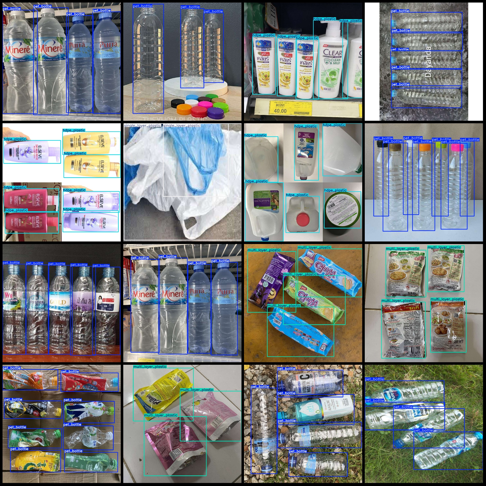
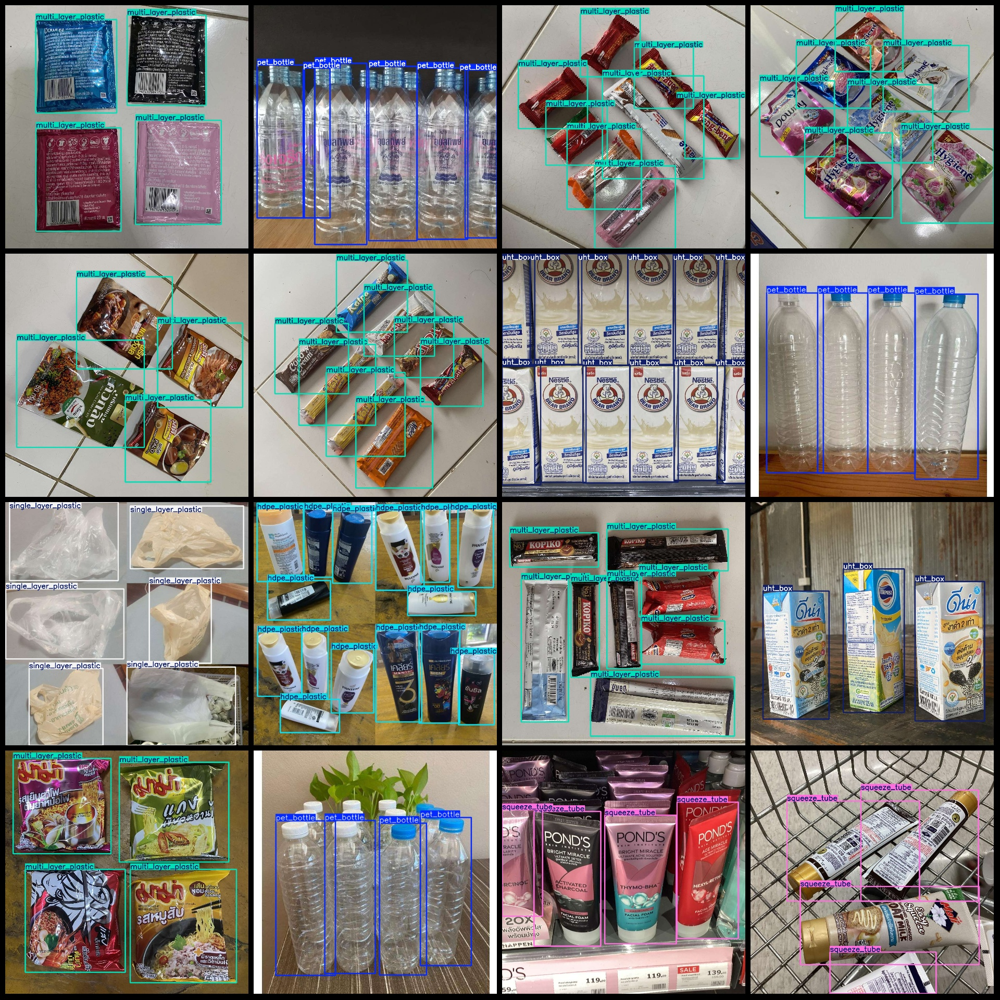

# Lifestyle Plastic Products Classification Dataset - Multi-category Plastic Object Identification and Detection in VOC+YOLO format with 3842 images across 7 categories

The dataset format is Pascal VOC format + YOLO format (txt files without split paths, only containing jpg images and corresponding VOC format xml files and yolo format txt files).
There are 3842 jpg files.
There are 3842 xml files.
The number of txt files is 3842.
annotationnumber of classes: 7  
["hdpe_plastic", "multi_layer_plastic", "pet_bottle", "single_layer_plastic", "single_use_plastic", "squeeze_tube", "uht_box"]
Number of boxes labeled in each category:
The number of HDPE_plastic (HDPE plastic) frames is 4591, and the number of images occupied is 620.
The number of multi-layer plastic (multi-layer plastic) frames is 5052, and the number of images occupied by these frames is 780.
The number of pet_bottle (PET plastic bottle) frames is 4839, and the number of pictures occupied is 904.
Single-layer plastic box count = 4326, images = 631
The number of single-use plastics = 2031, the number of images occupied = 308.
Squeeze Tube (squeeze tube) Box count = 2722, images = 347
UHT Box (Ultrasonic High Pressure Box) Box count = 3321, images = 416
Total frames: 26882
Image resolution: Multi-resolution, such as 1024x1024, 910x512, etc.
Using annotation tool: labelImg
Annotation rules: Draw a rectangle around the class.
Important notes: The dataset does not have a division into training, validation, and test sets; you need to partition it yourself.
Special statement: This dataset does not guarantee accuracy for the trained model or weight files.
Image preview:
## Image

Here is a pay link on Stripe ( https://buy.stripe.com/3cs8yP7sY87d0vu9AB ). Please contact me lonlonago@foxmail.com after funding $89, and I will send you a complete data files , thank you!

